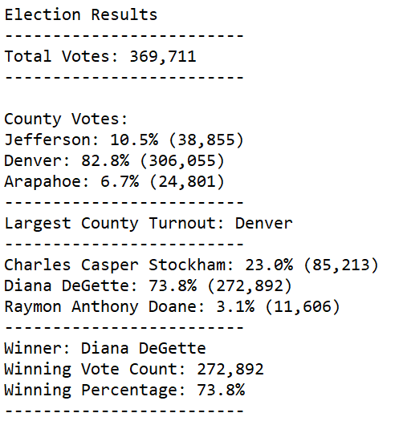

# Election Analysis

## Overview of Election Audit

### Purpose

###### The purpose of Module Three and the Election Analysis Challenge is to learn how to use the programming language, Python, in conjunction with the software, Microsoft Visual Studio Code.  By using Python and VS Code, it is my responsibility to confirm the winner of the election and analyze the data further to determine which county had the highest voter turnout.  The actual vote count and percentages were determined for each candidate and each county.  

### Election Audit Results

###### - **Total Votes:** 369,711 total votes were cast in this congressional election
###### - **Votes by County:** Jefferson: 10.5% (38,855); Denver: 82.8% (306,055); Arapahoe: 6.7% (24,801)
###### - **Largest County Turnout:** Denver County had the largest number of votes
###### - **Votes by Candidate:** Charles Casper Stockham: 23.0% (85,213); Diana DeGette: 73.8% (272,892); Raymon Anthony Doane: 3.1% (11,606)
###### - **Winner:** Diana DeGette 73.8% (272,892)

### Election Audit Summary

###### In a summary statement, provide a business proposal to the election commission on how this script can be used—with some modifications—for any election. Give at least two examples of how this script can be modified to be used for other elections.	